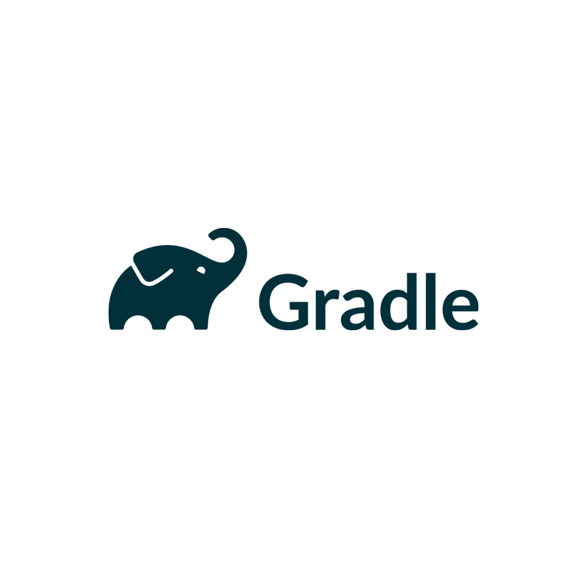
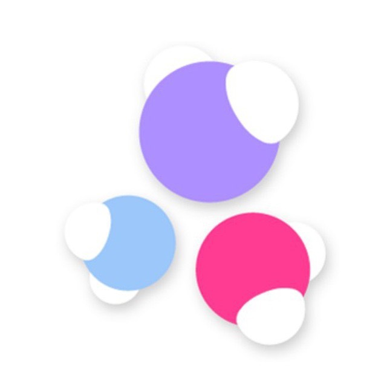
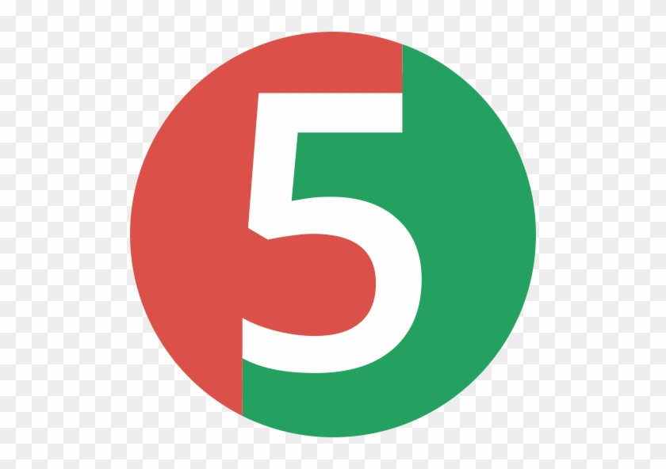
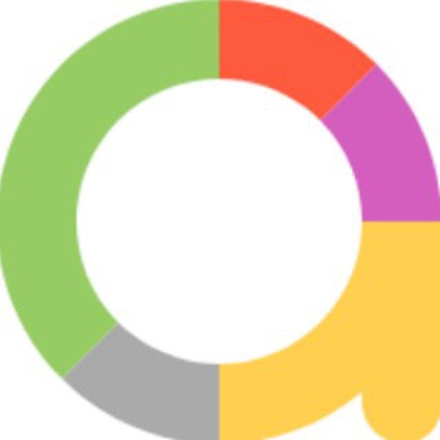
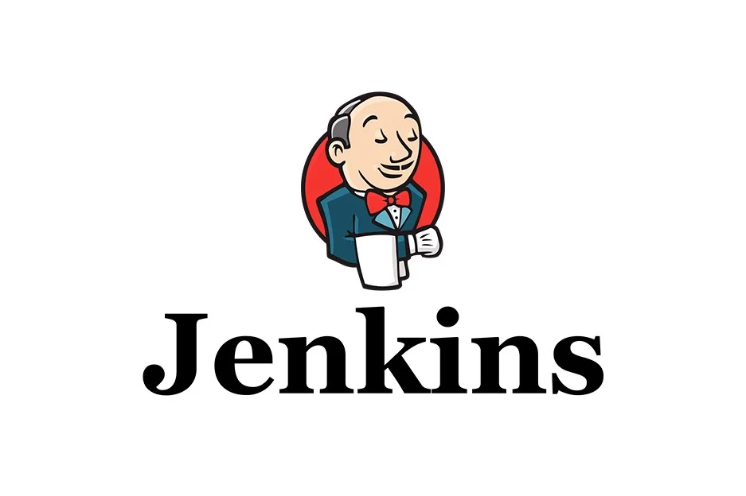

## Hello, my friend 👋

👨‍💻 Fullstack QA Engineer

🧑‍💻 In QA for more than 3 years:
+ Manual Testing
+ UI Automation

---

### 🛠️ What I use

      

### 💼 My recent project:
+ [Автотесты на сайт StopGame.ru](https://github.com/KuryaevAO/stopgame-test)   

---

---

### 📫 My contacts:
- Skype - [alexandr_kuryaev](https://join.skype.com/invite/MyO6wxEqSYI3) -->
- Telegram - https://t.me/threedoge
  -->
